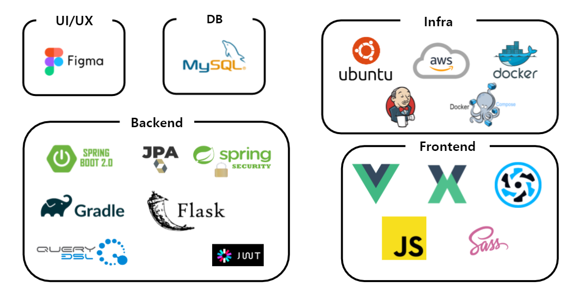
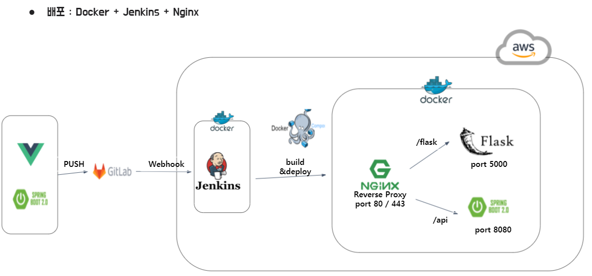
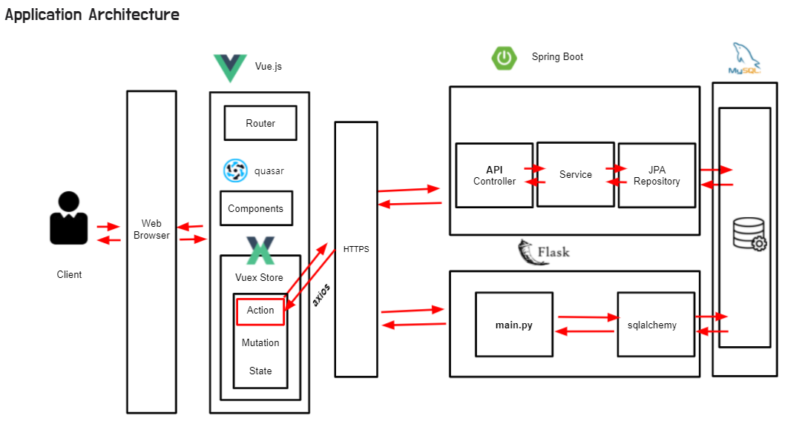
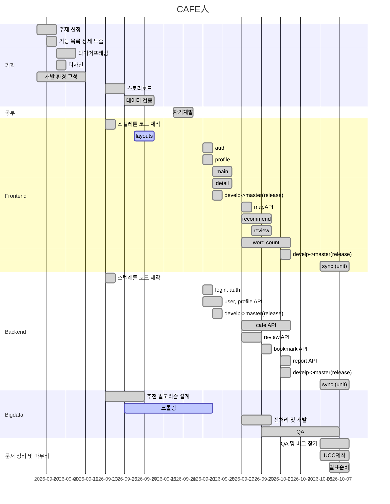
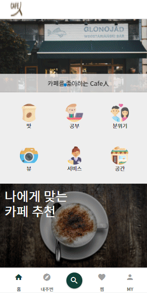
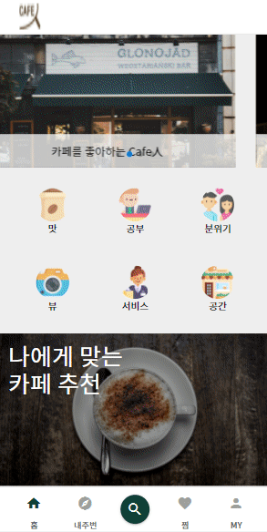

# **_CAFE 人_**

## CAFE 人 서비스

- 자신에게 맞는 카페로 카페 in 할 수 있게
  도와주는 카페 추천 서비스

## 🎈기술 스택

  
  

## 🎈프로젝트 세팅 방법

- [Frontend](./frontend/README.md)
- [Backend](./backend/README.md)

## 🎈개발 일정표

## 🎈CAFE 人 주요 기능 소개

### 카페 검색 서비스

<table>
    <tbody>
        <tr>
            <td rowspan=4>
            
            </td>
        </tr>
        <tr>
            <td>1. 검색어를 입력하여 내 위치로부터 가까운 카페들을 찾습니다.</td>
        </tr>
        <tr>
            <td>2. 검색된 카페리스트를 클릭하면 카페의 상세 정보를 볼 수 있습니다.</td>
        </tr>
        <tr>
            <td>3. 인증된 사용자는 검색된 카페를 찜할 수 있습니다.</td>
        </tr>
    </tbody>
</table>

### 카페 검색 서비스 - 내주변

<table>
    <tbody>
        <tr>
            <td rowspan=4>
            
            </td>
        </tr>
        <tr>
            <td>1. 내주변 탭을 클릭합니다.</td>
        </tr>
        <tr>
            <td>2. 내주변 카페 리스트를 카카오 맵으로 볼 수 있습니다.</td>
        </tr>
        <tr>
            <td>3. 인증된 사용자는 검색된 카페를 찜할 수 있습니다.</td>
        </tr>
    </tbody>
</table>

### 카테고리 기반의 카페 추천 서비스

<table>
    <tbody>
        <tr>
            <td rowspan=4>
            
            </td>
        </tr>
        <tr>
            <td>1. 메인화면에서 설정된 카테고리들을 클릭하여 내 주변에서 해당 카테고리와 연관성이 높은 카페들을 추천 받습니다.</td>
        </tr>
        <tr>
            <td>2. 검색된 카페리스트를 클릭하면 카페의 상세 정보를 볼 수 있습니다.</td>
        </tr>
        <tr>
            <td>3. 인증된 사용자는 추천받은 카페를 찜할 수 있습니다.</td>
        </tr>
    </tbody>
</table>

### 사용자 찜 기반의 카페 추천 서비스

<table>
    <tbody>
        <tr>
            <td rowspan=4>
            
            </td>
        </tr>
        <tr>
            <td>1. 인증된 사용자가 나에게 맞는 카페 큐레이션을 클릭할 수 있습니다.</td>
        </tr>
        <tr>
            <td>2. 나의 찜 리스트를 기반으로 나에게 맞는 카페들을 추천 받을 수 있습니다.</td>
        </tr>
    </tbody>
</table>

### 카페 리뷰 서비스

<table>
    <tbody>
        <tr>
            <td rowspan=5>
            
            </td>
        </tr>
        <tr>
            <td>1. 사용자가 추천된 카페를 클릭합니다.</td>
        </tr>
        <tr>
            <td>2. 카페 상세 정보를 보여주고 카페 리뷰에 들어간 명사들을 워드 클라우드 형태와 리스트형태로 보여줍니다.</td>
        </tr>
        <tr>
            <td>3. 인증되지 않은 사용자는 카페 리뷰를 보는것만 가능 합니다. 인증된 사용자는 카페에 대한 리뷰를 작성 할 수 있습니다.</td>
        </tr>
        <tr>
            <td>4. 작성된 리뷰는 내 리뷰 보기에서 모아 볼 수 있습니다.</td>
        </tr>
    </tbody>
</table>

## 🎈팀원 역할

|        | 팀장/팀원 |     역할      |
| :----: | :-------: | :-----------: |
| 한훈희 | **팀장**  |   Frontend    |
| 한상정 |   팀원    |   Frontend    |
| 김민정 |   팀원    |    Backend    |
| 조원식 |   팀원    | Backend&CI/CD |
| 오수형 |   팀원    |    Bigdata    |
