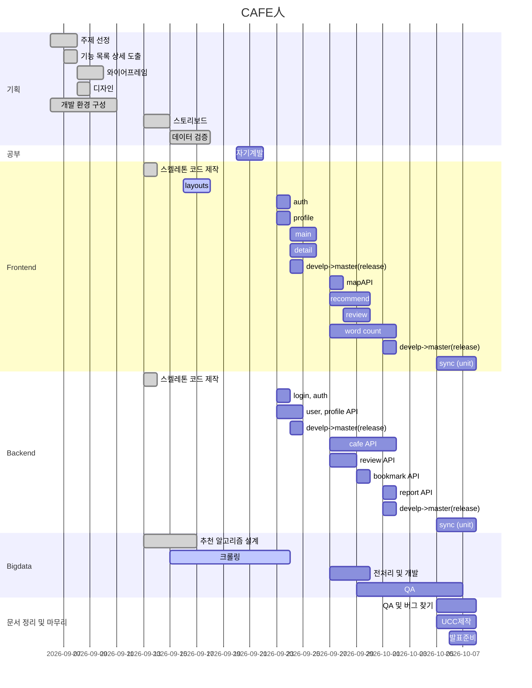

# **_CAFE 人_**

## CAFE 人 서비스

- 자신에게 맞는 카페로 카페 in 할 수 있게
  도와주는 카페 추천 서비스

## :heavy_check_mark: 기술 스택

  
  

## :heavy_check_mark: 프로젝트 세팅 방법

- [Frontend](./frontend/README.md)
- [Backend](./backend/README.md)

## 1. 일정표

##

### CAFE 人 주요 기능 소개

## :bulb: 팀원 역할

|        | 팀장/팀원 |     역할      |
| :----: | :-------: | :-----------: |
| 한훈희 | **팀장**  |   Frontend    |
| 한상정 |   팀원    |   Frontend    |
| 김민정 |   팀원    |    Backend    |
| 조원식 |   팀원    | Backend&CI/CD |
| 오수형 |   팀원    |    Bigdata    |
