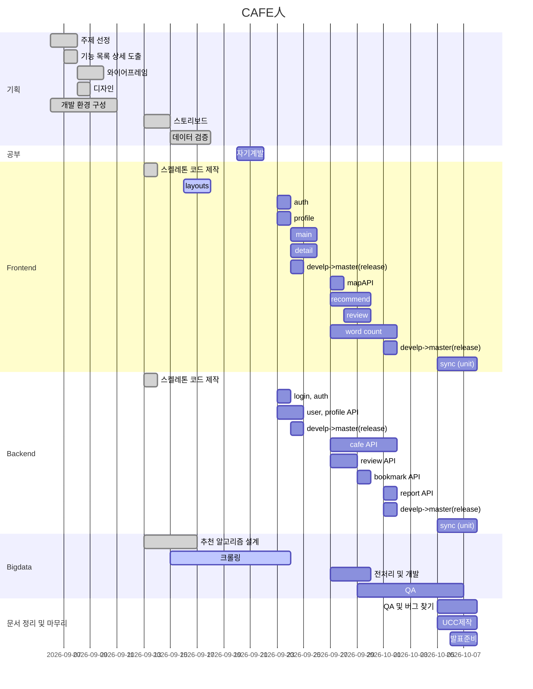

# ***CAFE人***

# 목차
1. [일정표](#1-일정표)
2. [산출물](#2-산출물)
  2-1. [ERD diagram](#2\-1-erd-diagram)
  2-2. [화면정의서](#2\-2-화면정의서)
3. [팀원 역할](#3-팀원-역할)

## 1. 일정표

## 2. 산출물
### 2-1. ERD diagram

### 2-2. 화면정의서
[Figma](https://www.figma.com/file/msAae4hEesmSnv3aJeYxuU/Coffee)

---

## 3. 팀원 역할
||팀장/팀원|역할|
|:---:|:---:|:---:|
|한훈희|**팀장**|Frontend|
|한상정|팀원|Frontend|
|김민정|팀원|Backend|
|조원식|팀원|Backend|
|오수형|팀원|Bigdata|

