# **_CAFE 人_**

## CAFE 人 서비스

- 자신에게 맞는 카페로 카페 in 할 수 있게
  도와주는 카페 추천 서비스

## :heavy_check_mark: 기술 스택

  
  

## 🎈프로젝트 세팅 방법

- [Frontend](./frontend/README.md)
- [Backend](./backend/README.md)

## 🎈개발 일정표

```mermaid
gantt
dateFormat MM-DD
title CAFE人

section 기획
주제 선정 :done, 09-06, 2d
기능 목록 상세 도출 :done, 09-07, 1d
와이어프레임 :done, 09-08, 2d
디자인 :done, 09-08, 1d
개발 환경 구성 :done, 09-06, 5d
스토리보드 :done, 09-13, 2d
데이터 검증 :done, 09-15, 3d

section 공부
자기계발 :after, 09-20, 2d

section Frontend
스켈레톤 코드 제작 :done, 09-13, 1d
layouts :active, 09-16, 2d
auth :after, 09-23, 1d
profile :after, 09-23, 1d
main :after, 09-24, 2d
detail :after, 09-24, 2d
develp->master(release) :after, 09-24, 1d
mapAPI :after, 09-27, 1d
recommend :after, 09-27, 3d
review :after, 09-28, 2d
word count: after, 09-27, 5d
develp->master(release) :after, 10-01, 1d
sync (unit): after, 10-05, 3d

section Backend
스켈레톤 코드 제작 :done, 09-13, 1d
login, auth :after, 09-23, 1d
user, profile API :after, 09-23, 2d
develp->master(release) :after, 09-24, 1d
cafe API :after, 09-27, 5d
review API :after, 09-27, 2d
bookmark API :after, 09-29, 1d
report API :after, 10-01, 1d
develp->master(release) :after, 10-01, 1d
sync (unit) :after, 10-05, 3d

section Bigdata
추천 알고리즘 설계 : done, 09-13, 4d
크롤링 : active, 09-15, 9d
전처리 및 개발 : after, 09-27, 3d
QA : after, 09-29, 8d

section 문서 정리 및 마무리
QA 및 버그 찾기 :after, 10-05, 3d
UCC제작 :after, 10-05, 3d
발표준비 :after, 10-06, 2d

```

## 🎈CAFE 人 주요 기능 소개

## 🎈팀원 역할

|        | 팀장/팀원 |     역할      |
| :----: | :-------: | :-----------: |
| 한훈희 | **팀장**  |   Frontend    |
| 한상정 |   팀원    |   Frontend    |
| 김민정 |   팀원    |    Backend    |
| 조원식 |   팀원    | Backend&CI/CD |
| 오수형 |   팀원    |    Bigdata    |
